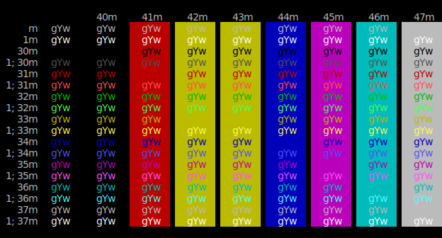

# ansisvg

Convert [ANSI](https://en.wikipedia.org/wiki/ANSI_escape_code) to [SVG](https://en.wikipedia.org/wiki/Scalable_Vector_Graphics).

Pipe output from a program thru ansisvg and it will output a SVG file on stdout. Can be used to
produce nice looking example output for presentations, markdown files etc.

```sh
./colortest | ansisvg > colortest.ansi.svg
 ```
Produces [colortest.ansi.svg](ansisvg/testdata/colortest.ansi.svg)



```
$ ansisvg -h
Usage of ansisvg:
  -charboxsize value
    	Character box size (default 8x16)
  -colorscheme string
    	Color scheme (default "Builtin Dark")
  -fontname string
    	Font name (default "Monaco, Lucida Console, Courier")
  -fontsize int
    	Font size (default 14)
  -transparent
    	Transparent background
  -width int
    	Terminal width (auto)
```

Color themes are the ones from https://github.com/mbadolato/iTerm2-Color-Schemes

## Install

```sh
# build from cloned repo
go build -o ansisvg main.go

# install directly
go install github.com/wader/ansisvg@master
# copy binary to $PATH
cp $(go env GOPATH)/bin/ansisvg /usr/local/bin
```

## Tricks

### Use `bat` to produce source code highlighting
`bat --color=always -p main.go | ansisvg`

### Use `script` to run with a pty
`script -q /dev/null <command> | ansisvg`

### ffmpeg
`TERM=a AV_LOG_FORCE_COLOR=1 ffmpeg ... 2>&1 | ansisvg`

### jq
`jq -C | ansisvg`

## Licenses and thanks

Color themes from
https://github.com/mbadolato/iTerm2-Color-Schemes,
license https://github.com/mbadolato/iTerm2-Color-Schemes/blob/master/LICENSE

colortest from https://github.com/pablopunk/colortest

## TODO and ideas
- Bold
- Underline overlaps a bit, sometimes causing weird blending
- Somehow use `<tspan>`/`textLength` to produce smaller output. Maybe `em/ch` CSS units for background rects,
but seems inkscape do not like `ch`. Would also make it nicer to copy text from SVG.
- Handle vertical tab and form feed (normalize into spaces?)
- Handle overdrawing
- More CSI, keep track of cursor?
- PNG output (embed nice fonts?)
